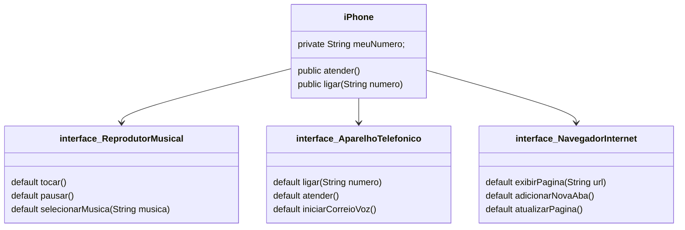

```mermaid
classDiagram
    class interface_ReprodutorMusical {
        default tocar()
        default pausar()
        default selecionarMusica(String musica)
    }

    class interface_AparelhoTelefonico {
        default ligar(String numero)
        default atender()
        default iniciarCorreioVoz()
    }

    class interface_NavegadorInternet {
        default exibirPagina(String url)
        default adicionarNovaAba()
        default atualizarPagina()
    }

    class iPhone {
        private String meuNumero;

        public atender()
        public ligar(String numero)
    }

    iPhone --> interface_ReprodutorMusical
    iPhone --> interface_AparelhoTelefonico
    iPhone --> interface_NavegadorInternet
```
